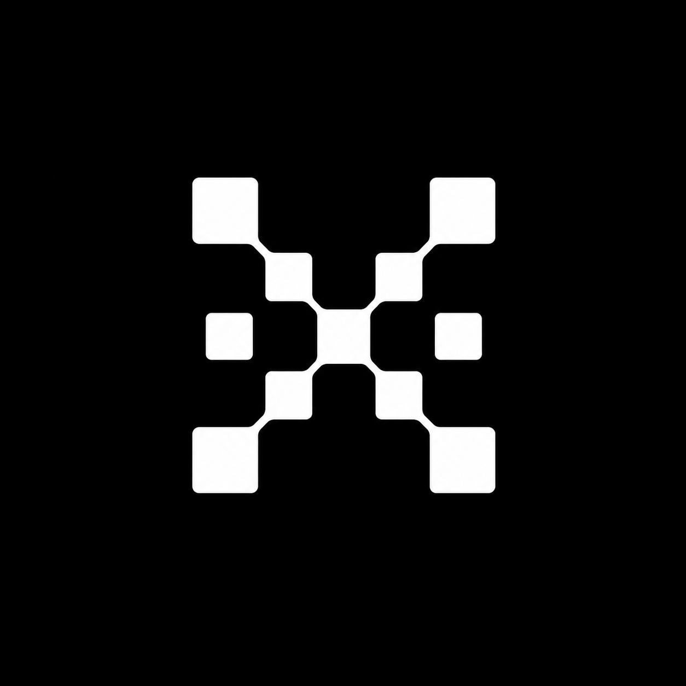
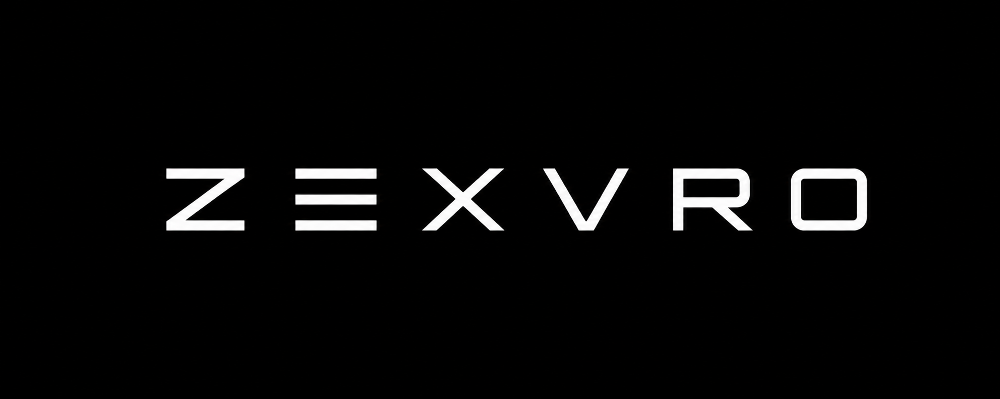

  

  

  <strong>Unified Web3 PaaS for teams building private, verifiable, agent-ready infrastructure.</strong>

  <a href="context.md">Context</a>
  ·
  <a href="memory.md">Shared Memory</a>
  ·
  <a href="assets/brand">Brand Assets</a>

  
  
  
  

---

## Vision

ZEXVRO is a clean, developer-first platform for moving Web2 products into Web3 infrastructure without exposing teams to unnecessary blockchain complexity.

The product direction is simple: Vercel/Cloudflare-level clarity, Web3-native rails, and an agent-first workflow that helps developers move faster without losing project context.

## Repository

This repository currently holds the project foundation:

- `context.md` - product, team, stack, and setup context.
- `memory.md` - shared working memory for developers and agents.
- `assets/brand/` - logo, typo logo, and brand design assets.

Before starting work, read `context.md` and `memory.md`. After meaningful changes, update `memory.md` and commit the memory update with the code.
