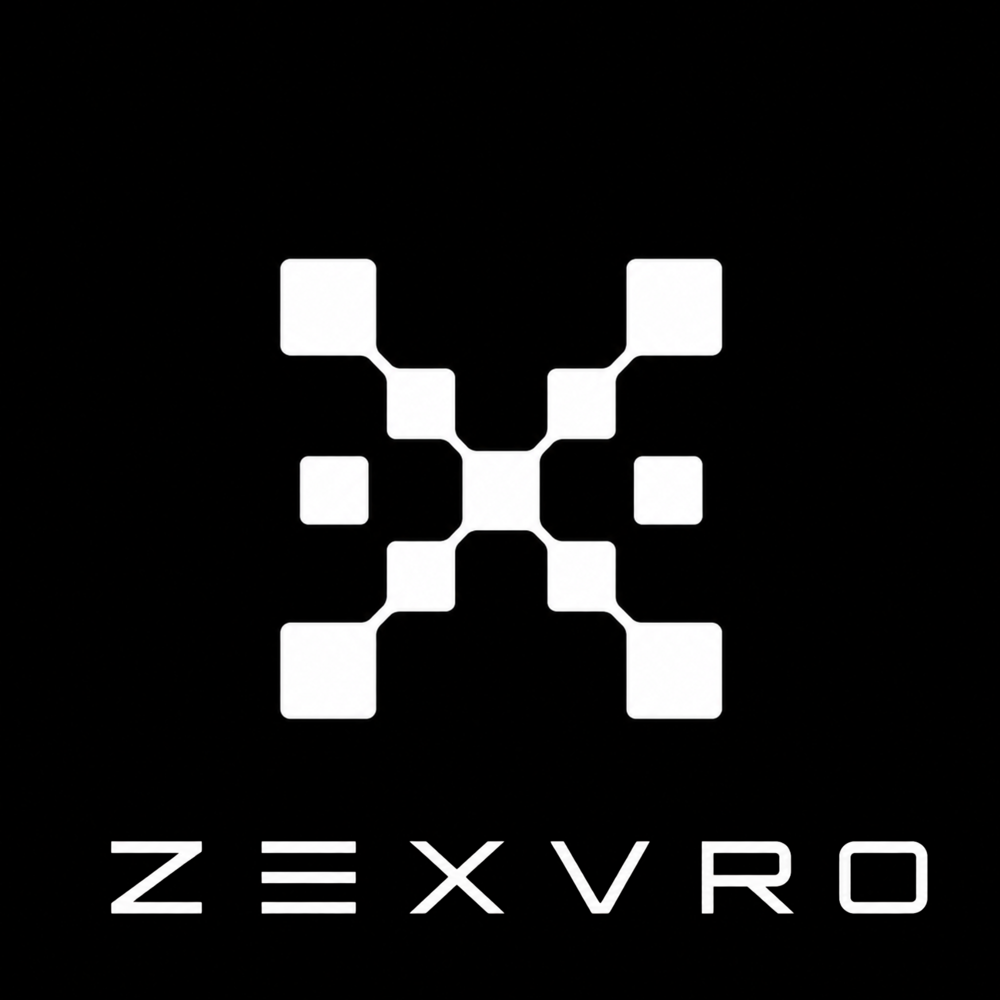

<p align="center">
  
</p>

<p align="center">
  <strong>Unified Web3 PaaS for teams building private, verifiable, agent-ready infrastructure.</strong>
</p>

<p align="center">
  <a href="context.md">Context</a>
  ·
  <a href="memory.md">Shared Memory</a>
  ·
  <a href="design.md">Design</a>
  ·
  <a href="frontend">Frontend</a>
  ·
  <a href="assets/brand">Brand Assets</a>
</p>

<p align="center">
  
  
  
  
</p>

---

## Vision

ZEXVRO is a clean, developer-first platform for moving Web2 products into Web3 infrastructure without exposing teams to unnecessary blockchain complexity.

The product direction is simple: Vercel/Cloudflare-level clarity, Web3-native rails, and an agent-first workflow that helps developers move faster without losing project context.

## Repository

This repository currently holds the project foundation:

- `context.md` - product, team, stack, and setup context.
- `memory.md` - shared working memory for developers and agents.
- `design.md` - visual system, themes, typography, and UI rules.
- `frontend/` - Vite + React frontend workspace.
- `assets/brand/` - logo, typo logo, and brand design assets.

Before starting work, read `context.md` and `memory.md`. After meaningful changes, update `memory.md` and commit the memory update with the code.

## Local Development

Use the repository root as the control point for local config and servers:

```bash
cp .env.example .env
npm run dev
```

`npm run dev` starts the NFT API and frontend together. The root dev script loads
`.env` and `.env.local`, injects the same environment into both processes, and
uses the local Stellar CLI identity in `ZEXVRO_STELLAR_IDENTITY` when
`STELLAR_SPONSOR_SECRET` is empty.

```bash
npm run dev:all
```

Use `dev:all` when you also want the De-pin gateway. Keep real secrets only in
root `.env` or your shell; folder-level `.env.example` files are compatibility
pointers to the root template.

## NFT smoke

After `npm run dev`, check the API with:

```bash
npm run nft:smoke
```

Full signed-in browser steps live in `services/nft-service/README.md`.

